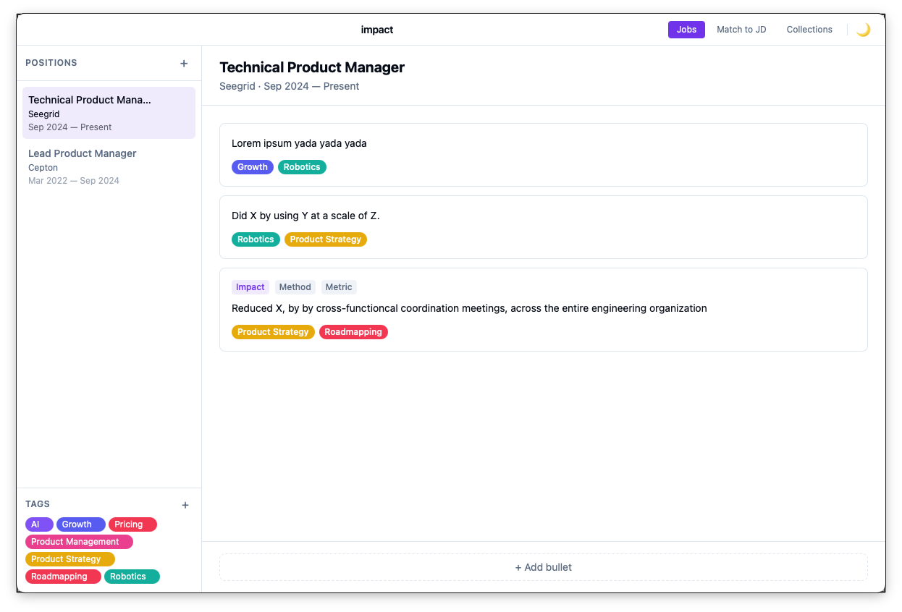

# Impact

A macOS desktop app for managing resume job bullets. Build a personal bank of achievements organized by position, tag them by skill or theme, and quickly select the best ones when applying to a new role.



## Features

- **Jobs view** — Organize bullets by position. Each bullet supports a structured IMM format (Impact, Method, Metric) that auto-composes a sentence, or freeform custom text.
- **Match to JD** — Paste a job description, browse all your bullets by job, check the ones that fit, and copy them to your clipboard in one click.
- **Collections** — Browse every bullet across all positions, filterable by tag and by job.
- **Tags** — Create color-coded tags to categorize bullets by skill, domain, or anything else.
- **Local-first** — All data is stored in a SQLite database on your machine. Nothing leaves your computer.

## Install

Download the latest `.dmg` from [Releases](https://github.com/chrisnick10/impact/releases), open it, and drag Impact to your Applications folder.

> **Note:** The app is not code-signed. On first launch, right-click the app → Open to bypass the macOS Gatekeeper warning.

## Tech stack

- [Tauri 2](https://tauri.app) — Rust shell + native macOS WebView
- React + TypeScript + Vite
- SQLite via [@tauri-apps/plugin-sql](https://github.com/tauri-apps/tauri-plugin-sql)
- TailwindCSS + Zustand

## Development

```bash
# Prerequisites: Node.js 20+, Rust (rustup)
npm install
npm run tauri dev
```

## License

MIT — see [LICENSE](LICENSE)
